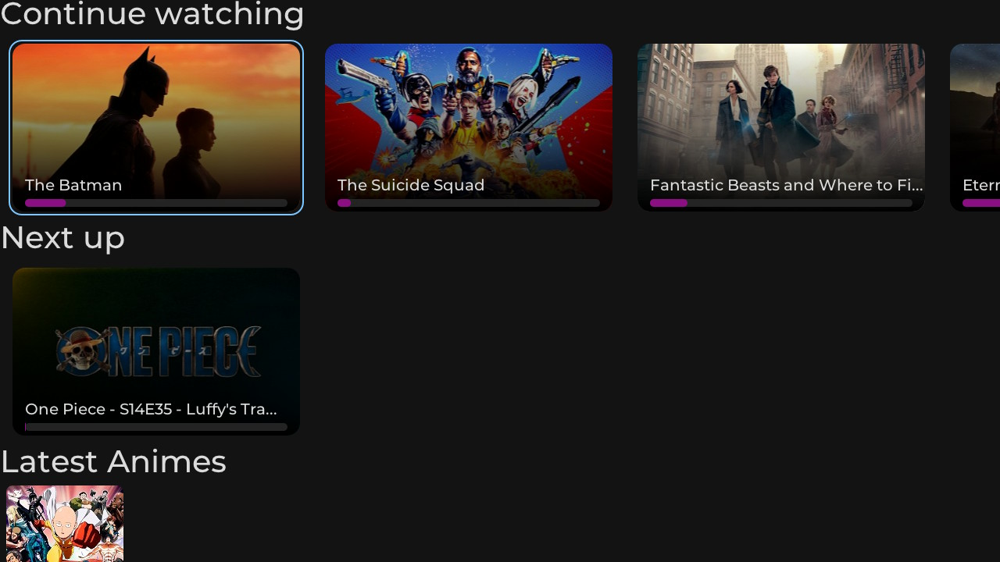

# Switchfin
### Jellyfin client for the Switch

Switchfin is a Jellyfin client that allow you to stream all your media from your Jellyfin server directly to your switch.




## Compiling for the switch

Dependencies:
* SFML from https://github.com/gandous/SFML-switch
* libmpv
* libcurl

```
mkdir build && cd build
cmake .. -DCMAKE_TOOLCHAIN_FILE=../cmake/toolchains/DevkitA64Libnx.cmake
make -j 4
```